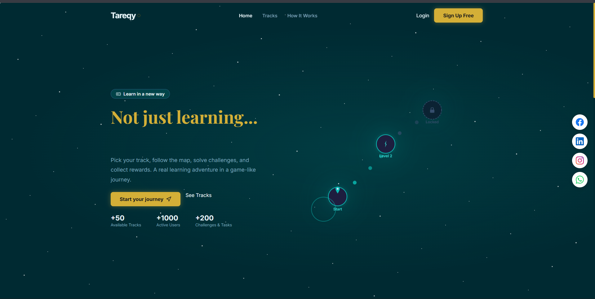

# 🚀 Tareqy (طريقي) - Career Roadmap & Progress Tracker



<div align="center">
  
  
  
  
</div>

<br>

**Tareqy** is a comprehensive, full-stack platform designed to empower programmers to track their learning progress, follow structured roadmaps, and manage their educational journey effectively. Built with the **MEAN Stack**, it focuses on clean architecture, scalability, and an intuitive user experience.


---

## 🌟 Overview
Developing Tareqy was aimed at solving the common problem of "tutorial hell." By providing a clear path for skill acquisition and verification through practical challenges and checkpoints, the platform ensures continuous and measurable growth for developers.

## ✨ Core Features
* **Roadmap Tracking:** Visual progression through tailored learning paths.
* **Challenge System:** Integrated coding challenges with automated submission tracking.
* **Role-Based Access Control (RBAC):** Dedicated, secure dashboards for Admins, Instructors, and Code Reviewers.
* **Checkpoint Management:** Structured levels and curated resources for logical learning flow.
* **Authentication & Security:** Secure login using JWT (JSON Web Tokens) and OTP verification.
* **Gamification:** Scoring system and progress logs to keep users motivated.
* **Comprehensive Testing:** Unit and Integration tests to ensure backend reliability.

---

## 🛠️ Tech Stack
### **Frontend**
* **Framework:** Angular (v17+)
* **Styling:** CSS3 (Fully Responsive)
* **State Management:** RxJS (Reactive Programming)

### **Backend**
* **Runtime:** Node.js
* **Framework:** Express.js
* **Database:** MongoDB with Mongoose ODM
* **Validation:** Custom Validation Middlewares
* **Testing:** Jest Framework

---

## 📂 Project Structure

Here is the exact architectural layout of the application:

## 📂 Project Structure

Here is the exact architectural layout of the application, demonstrating a modular and scalable design for both Backend and Frontend:
```text
TAREQY FINAL/
├── Backend/                 # Node.js & Express API
│   ├── config/              # Environment and configuration files
│   ├── Database/            # DB connection logic and setup
│   ├── docs/                # API documentation files
│   ├── Middlewares/         # Custom Express middlewares (Auth, Error handling)
│   ├── Modules/             # Domain-driven feature modules
│   │   ├── admin/           # Admin operations and management
│   │   ├── challenge/       # Coding challenges logic
│   │   ├── checkpoint/      # Learning checkpoints management
│   │   ├── codeReviewer/    # Code reviewer specific functionalities
│   │   ├── feedback/        # System and user feedback handling
│   │   ├── instructor/      # Instructor dashboard and course logic
│   │   ├── level/           # Hierarchy of learning levels
│   │   ├── resources/       # Educational materials and links
│   │   ├── scores/          # Gamification and user scoring system
│   │   ├── step/            # Granular roadmap steps
│   │   ├── submission/      # Handling and tracking user code submissions
│   │   ├── task/            # Specific task assignments
│   │   ├── track/           # Core career roadmaps logic
│   │   └── users/           # User authentication & profiles
│   ├── public/              # Static files served by the backend
│   ├── tests/               # Jest test suites for unit/integration testing
│   ├── utils/               # Helper functions and reusable utilities
│   ├── validation/          # Request payload validation schemas
│   ├── .env                 # Environment variables
│   ├── .gitignore           # Git ignore configurations
│   ├── app.js               # Express application configuration
│   ├── check_users.js       # Utility script for user management
│   ├── index.js             # Entry point of the server
│   ├── jest.config.js       # Jest testing configuration
│   ├── package.json         # Backend dependencies and scripts
│   ├── seed_admin.js        # Admin database seeding script
│   ├── seed-videos.js       # Videos database seeding script
│   └── seed.js              # Main database seeding script
│
└── frontend/                # Angular Client Application
    ├── .angular/            # Angular cache and build optimizations
    ├── app/                 # Main Angular application code
    │   ├── core/            # Singleton services and core configurations
    │   ├── environments/    # Environment-specific variables (dev, prod)
    │   ├── features/        # Feature-based modules (Domain Logic)
    │   │   ├── admin/       # Admin dashboard & management UI
    │   │   ├── auth/        # Authentication UI (Login, OTP, Register)
    │   │   ├── challenge/   # Coding challenges interface
    │   │   ├── dashboard/   # Main user dashboard
    │   │   ├── home/        # Landing page
    │   │   ├── level/       # Learning checkpoints UI
    │   │   ├── profile/     # User profile management UI
    │   │   └── track/       # Career roadmap tracking UI
    │   ├── guards/          # Route guards for role-based access control (RBAC)
    │   ├── services/        # API integration and global services
    │   ├── shared/          # Reusable UI components, pipes, and directives
    │   ├── app.component.* # Root component (HTML, CSS, TS, Spec)
    │   ├── app.config.ts    # Application providers configuration
    │   └── app.routes.ts    # Application routing definitions
    ├── assets/              # Static assets (images, icons)
    ├── dist/                # Production build output
    ├── index.html           # Main HTML template
    ├── main.ts              # Angular entry point
    ├── styles.css           # Global stylesheet
    ├── angular.json         # Angular workspace configuration
    └── package.json         # Frontend dependencies and scripts
```

## ⚙️ Installation & Setup
To run this project locally, follow these steps:

1. Backend Setup
```Bash
# Navigate to the Backend directory
cd Backend

# Install dependencies
npm install

# Set up environment variables
# Create a .env file based on the config structure (PORT, DB_CONNECTION, JWT_SECRET)

# (Optional) Seed the database with initial dummy data
node seed.js

# Start the development server
npm start
```
2. Frontend Setup
```Bash
# Navigate to the Frontend directory
cd frontend

# Install dependencies
npm install

# Start the Angular development server
ng serve
```
Open http://localhost:4200 in your browser to view the app.


## 📡 API Documentation
The backend includes structured endpoints categorized by domain modules. For detailed request/response schemas, refer to the /docs folder or the Postman collection.

Auth: POST /api/auth/login, POST /api/auth/register

Users: GET /api/users/profile, PUT /api/users/update

Challenges: GET /api/challenges, POST /api/challenges/submit

## 🤝 Contributing
Contributions, issues, and feature requests are welcome!

Fork the Project

Create your Feature Branch (git checkout -b feature/AmazingFeature)

Commit your Changes (git commit -m 'Add some AmazingFeature')

Push to the Branch (git push origin feature/AmazingFeature)

Open a Pull Request

## 👨‍💻 Developer
**Steven Ashraf**
Full-Stack Developer | Computer Science Student at Minya University
